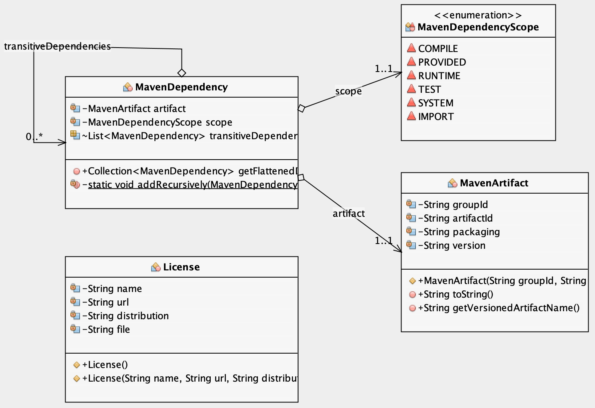

# lib-mavenator

**Utilities for Maven artifact processing**

This library provides a set of tools for runtime visibility of a Java application:

  * dependencies (direct and transitive),
  * dependency versions,
  * licenses.

In order to achieve this, we ask Maven to add some extra information into the application artifact during the normal build process.

## Maven plugins

Maven has a large ecosystem of plugins that can extend the normal build process. In particular, here we use

* the dependency plugin and its `tree` goal to collect the dependency hierarchy
    * This goal can be tried on any Maven project by running `mvn dependency:tree`.
* Maven license plugin and the `download-licenses` goal
    * This goal can be tried on any Maven project by running `mvn license:download-licenses`. By default the output gets
      saved in `target/generated-resources`. The XML file `licenses.xml` has a machine readable list of dependencies and thei
      associated licenses. The actual license files are in `target/generated-resources/licenses`.

## Class hierarchy

This library reads dependency information into a set of immutable DTOs that are in the `model` package.



## How to use

Two steps to get this working:

1. **write** the dependency/license info into the target artifact (see _POM file additions_)
2. **read** this information in your application at runtime.
    1. Include this library as a dependency. At runtime, call `AppMetadata.getInstance()` which provides an entry point
      to dependency and license information. See the unit tests for usage examples.

### POM file additions

The Maven POM file top-level project has to be 'enriched' with the following in the `build` section.

```xml
<plugins>
  <plugin>
    <groupId>org.apache.maven.plugins</groupId>
    <artifactId>maven-dependency-plugin</artifactId>
    <version>3.1.1</version>
    <executions>
      <execution>
        <configuration>
          <outputFile>${project.build.directory}/classes/META-INF/build/dependency-tree.txt</outputFile>
        </configuration>
        <phase>compile</phase>
        <goals>
          <goal>tree</goal>
        </goals>
      </execution>
    </executions>
  </plugin>
  <plugin>
    <groupId>org.codehaus.mojo</groupId>
    <artifactId>license-maven-plugin</artifactId>
    <version>1.17</version>
    <executions>
      <execution>
        <configuration>
          <licensesOutputDirectory>${project.build.directory}/classes/META-INF/build/licenses</licensesOutputDirectory>
          <licensesOutputFile>${project.build.directory}/classes/META-INF/build/licenses.xml</licensesOutputFile>
        </configuration>
        <phase>compile</phase>
        <goals>
          <goal>download-licenses</goal>
        </goals>
      </execution>
    </executions>
  </plugin>
</plugins>
```

Note that the required Maven goals are run during the `compile` phase of the build. In order to have these files available
(e.g. when running the unit tests) one must first run a Maven build (`mvn package`).

### Writing the application version into the Manifest file

This is an optional step but can be useful in some contexts. This allows retrieving the application version using code:

```java
SomeClass.class.getPackage().getImplementationVersion();
```

For this to work (return non-null), the Maven JAR plugin (or the WAR plugin, for Java EE Web projects) have to be
asked to include this information. For Java JAR projects:

```xml
<plugin>
  <groupId>org.apache.maven.plugins</groupId>
  <artifactId>maven-war-plugin</artifactId>
  <configuration>
    <archive>
      <manifest>
        <addDefaultImplementationEntries>true</addDefaultImplementationEntries>
        <addDefaultSpecificationEntries>true</addDefaultSpecificationEntries>
      </manifest>
    </archive>
  </configuration>
</plugin>
```

For WAR projects:

```xml
<plugin>
  <groupId>org.apache.maven.plugins</groupId>
  <artifactId>maven-jar-plugin</artifactId>
  <configuration>
    <archive>
      <manifest>
        <addDefaultImplementationEntries>true</addDefaultImplementationEntries>
        <addDefaultSpecificationEntries>true</addDefaultSpecificationEntries>
      </manifest>
    </archive>
  </configuration>
</plugin>
```

# License

Copyright 2019 Key Bridge. License is **Apache 2.0**.

